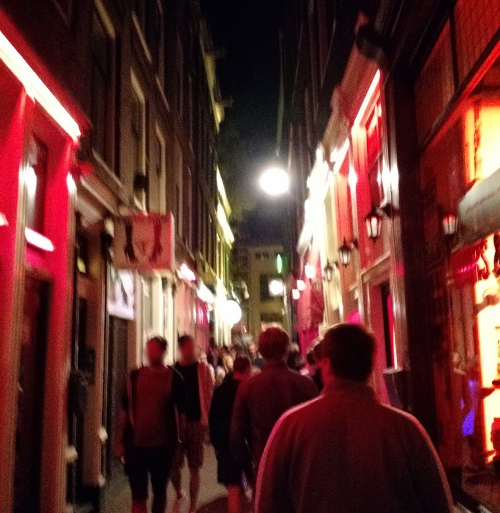

#HSLIDE

## Laracon.eu 2016

#HSLIDE

### The venue

#VSLIDE

#### Entrance

#VSLIDE

#### Food area

#VSLIDE

#### Blue track

#VSLIDE

#### Red track

#HSLIDE

### Cool stuff

 * Taylor Otwell was there
   * Gave a keynote on _What's new in Laravel 5.3_
   * Released L5.3 during the conference <!-- .element: class="fragment" -->
 * Cool venue <!-- .element: class="fragment" -->
 * Good food and plenty of coffee <!-- .element: class="fragment" -->
 * Recordings to published soon <!-- .element: class="fragment" -->

#VSLIDE

### What's new in Laravel 5.3
 * _Laravel Echo_
   * Propagate events inside the application to the client via WebSockets
 * _Laravel Passport_
   * OAuth2 authorization of APIs

#VSLIDE

### Dependency injection

 * Talk: _IoC Container Beyond Constructor Injection_
 * We should take a look at _Contextual binding_ to see if we can simplify our existing setup

#VSLIDE

### Database migrations

 * Talk: _How To Avoid Database Migration Hell_
 * We underutilize the seeding functionality provided by Laravel
 * Seeders calling other seeders: <!-- .element: class="fragment" -->
   * `ProductionSeeder`
   * `DevelopmentSeeder`
   * `TestingSeeder`

#VSLIDE

### MySQL 5.7

 * MySQL 5.7 has been released and is available on AWS RDS
 * Relevant changes: <!-- .element: class="fragment" -->
   * Native JSON support
   * Generated columns
   * `0000-00-00` and `0000-00-00 00:00:00` no longer allowed
   * `only_full_group` enforced by default
   * A lot stricter - error when too long a string was inserted instead of truncating

#VSLIDE

### Vue.js

 * Heard nothing but good about it
 * Officially supported by Laravel
 * Easy setup of the new event broadcasting in Laravel 5.3

#HSLIDE

#### Random stuff

#HSLIDE

#### Random stuff - contd

