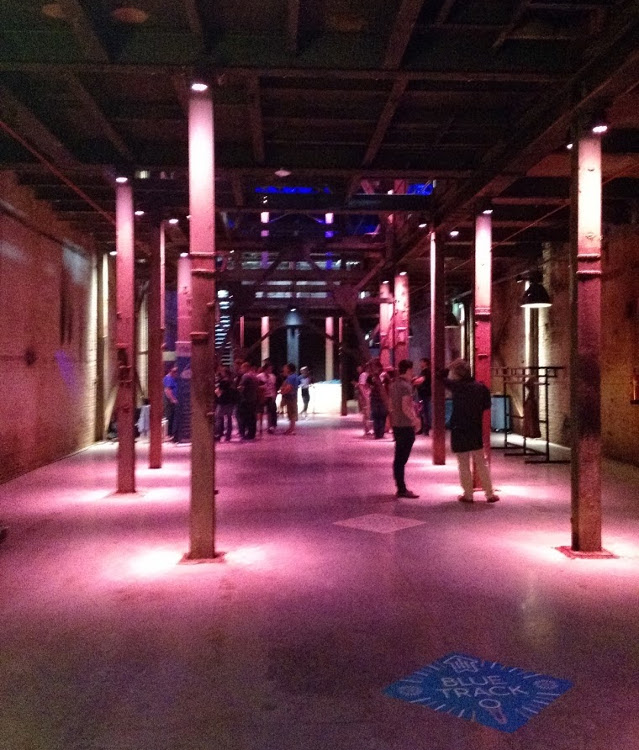
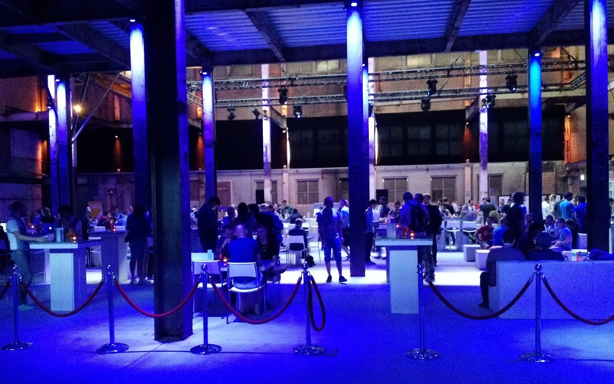
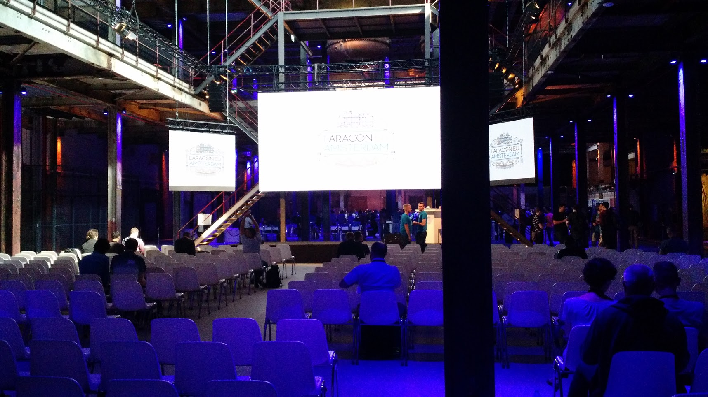
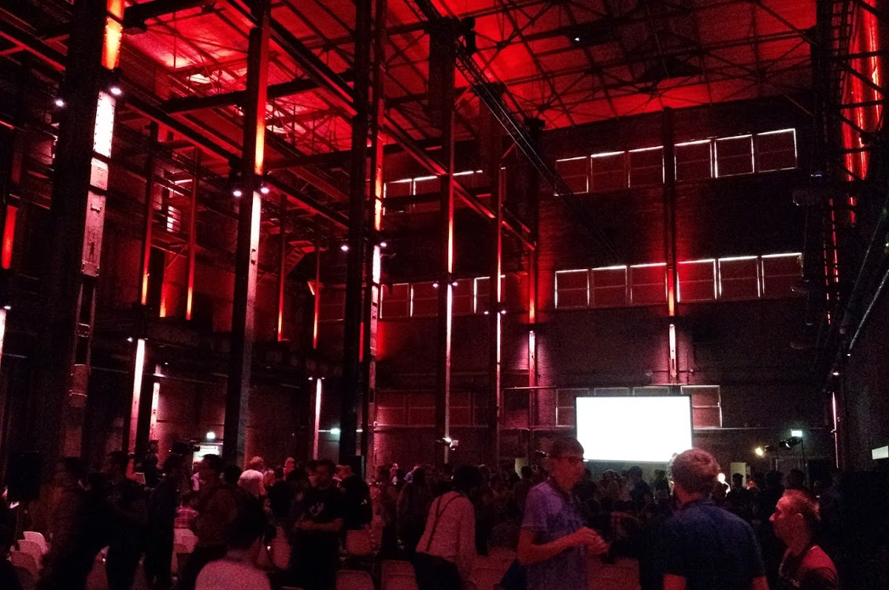

#HSLIDE?image=images/laraconeu_2016.jpg

# Laracon.eu 2016

#HSLIDE

## The venue

#VSLIDE

#### Entrance

#VSLIDE

#### Food area

#VSLIDE

#### Blue track

#VSLIDE

#### Red track

#HSLIDE

## Cool stuff

 * Taylor Otwell was there
   * Gave a keynote on _What's new in Laravel 5.3_
   * Released L5.3 during the conference <!-- .element: class="fragment" -->

#VLSIDE

## What's new in Laravel 5.3
 * _Laravel Echo_
   * Propagate events inside the application to the client via WebSockets
 * _Laravel Passport_ <!-- .element: class="fragment" -->
   * OAuth2 authorization of APIs

#VSLIDE

## Other stuff

 * Dependency injection 
   * _IoC Container Beyond Constructor Injection_
   * Clean up our existing setup
 * Database migrations <!-- .element: class="fragment" -->
   * _How To Avoid Database Migration Hell_
   * We underutilize Laravel's `Seeder`s
     * Seeders calling other seeders
     * `ProductionSeeder`
     * `DevelopmentSeeder`
     * `TestingSeeder`

#VSLIDE

## Other stuff - contd

 * MySQL 5.7 has been released and is available on AWS RDS
 * Relevant changes: <!-- .element: class="fragment" -->
   * Native JSON support
   * Generated columns
   * `0000-00-00` and `0000-00-00 00:00:00` no longer allowed
   * `only_full_group` enforced by default

#VSLIDE

## Other stuff - contd

 * Heard good stuff about _Vue.js_
 * Officially supported by Laravel
 * Easy setup of event broadcasting

#HSLIDE

## Random stuff

#HSLIDE

## Random stuff - contd

